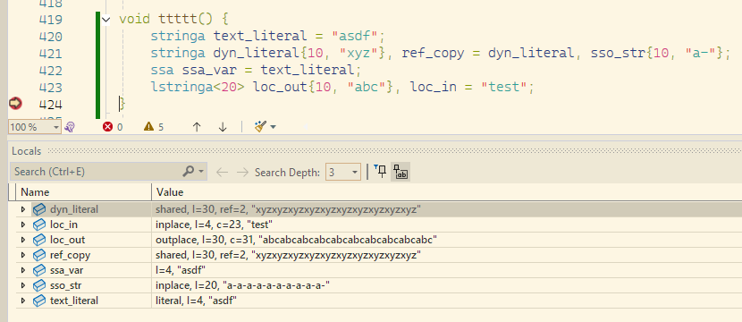
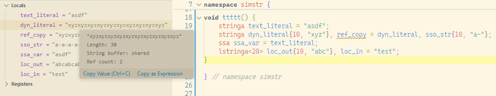

# simstr Objects in Debuggers
[On Russian | По-русски](readme_ru.md)

Two files have been prepared for more convenient display of simstr objects in msvc and gdb debuggers:
`simstr.natvis` - for use in the MSVC debugger, and `simstr_pretty_print.py` for working with gdb.

# simstr Objects in Debuggers
### Visual Studio
If you are working in MS Visual Studio, simstr.natvis is automatically added to the pdb file,
and provides convenient viewing of simstr string objects wherever this library is used.



# simstr Objects in Visual Studio Code
## When working in gdb
In the debugger configuration, you need to add the following lines:

```
    "setupCommands": [
        {
            "description": "Enable pretty-printing for gdb",
            "text": "-enable-pretty-printing",
            "ignoreFailures": true
        },
        {
            "description": "Enable pretty-printing for simstr",
            "text": "source ${workspaceFolder}/for_debug/simstr_pretty_print.py",
            "ignoreFailures": true
        }
    ]
```

After that, simstr objects will be conveniently displayed in the debugger.
The script inspects variables of these types and provides a textual description for them, displaying their
content in a convenient form. The first line displays the basic information visible in the
variable inspection window. When you hover the mouse over a variable in the source code window
or over a value in the variable inspection window, the remaining information will be shown in the pop-up tooltip.

Debugger configurations are located in the `.vscode/launch.json` file.
You may also have the `CMake Tools` extension installed, which allows you to select the target project to run.
In this case, the settings for connecting the script are written in `.vscode/settings.json`:

```
    "cmake.debugConfig": {
        "MIMode": "gdb",
        "environment": [],
        "setupCommands": [
            {
                "description": "Enable pretty-printing for gdb",
                "text": "-enable-pretty-printing",
                "ignoreFailures": true
            },
            {
                "text": "source ${workspaceFolder}/for_debug/simstr_pretty_print.py",
                "description": "pretty print simstr",
                "ignoreFailures": true
            }
        ]
    }
```

### Result


If you are working with the MSVC debugger in Visual Studio Code, that is, in launch.json `"type": "cppvsdbg"`, then the setting is different:
```
    "configurations": [
        {
            .....
            "type": "cppvsdbg",
            ....
            "visualizerFile": "${workspaceFolder}/for_debug/simstr.natvis"
        },
        ...
```
